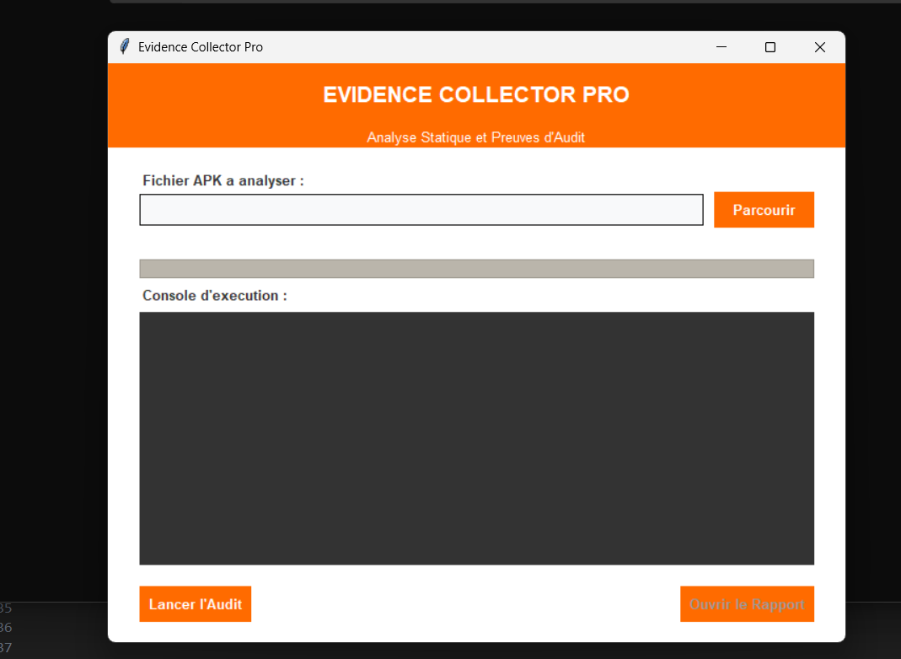
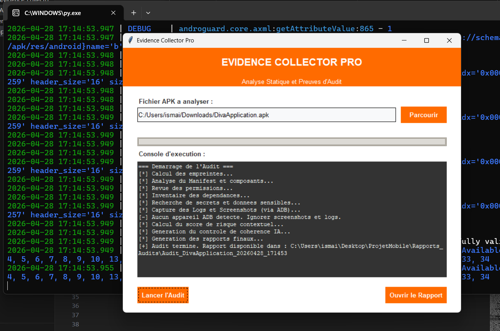
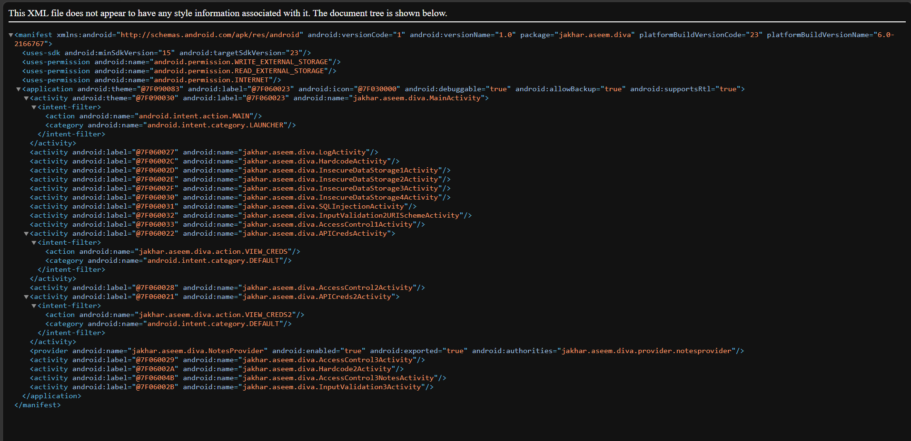
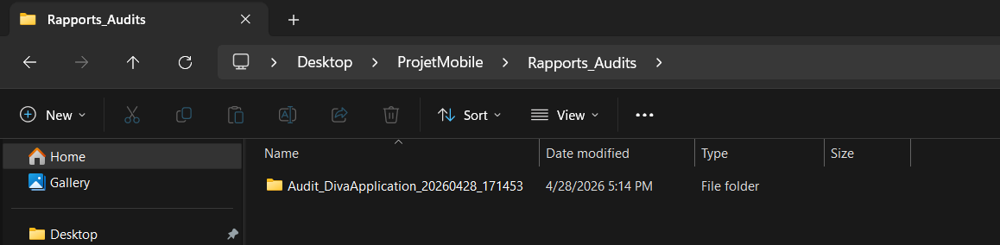

# ProjetMobile-Evidence-Collector-Compliance-Pack-preuves-d-audit

# Evidence Collector Pro (OWASP Mobile Audit)

**Evidence Collector Pro** est un outil automatisé écrit en Python, conçu pour assister les professionnels de la cybersécurité dans l'audit des applications Android (APK). Il réalise la phase de "Reconnaissance Défensive" en extrayant automatiquement les preuves nécessaires pour générer un rapport de conformité **OWASP MASVS / MASTG**.

---

## Objectif du Projet
Lors d'un audit de sécurité mobile, la récolte de preuves (hashes, permissions, composants, données sensibles) est une tâche longue et répétitive. 
Cet outil automatise cette collecte, analyse les vulnérabilités de configuration (Analyse Statique) et génère un livrable professionnel, neutre, et directement exploitable.

---

## Fonctionnalités Principales

1. **Extraction Automatisée (Pack Evidence)** :
   - Signature SHA-256 (Garantie d'intégrité de l'APK).
   - Fichier `AndroidManifest.xml` lisible.
   - Liste des Permissions et des Composants Exportés (Surface d'attaque).
   - SBOM (Software Bill of Materials) des bibliothèques natives `.so`.
   - Scan et extraction de Secrets anonymisés (URLs, Tokens, Clés API).

2. **Capture Dynamique via ADB** :
   - *Screenshot UI* : Capture l'écran de l'appareil connecté.
   - *Logs Anonymisés* : Extrait le système Logcat en masquant automatiquement les Adresses IP et Emails.

3. **Dashboard HTML & Conformité** :
   - Génère un rapport HTML interactif et professionnel.
   - Inclus un **Mapping OWASP** : Relie directement chaque preuve trouvée à un test MASTG spécifique (ex: MASVS-STORAGE-1).

4. **Contrôle de Cohérence IA** :
   - L'outil vérifie lui-même son travail et génère un rapport (`ia_coherence_summary.txt`) alertant l'auditeur si une preuve exigée par le référentiel manque à l'appel.

---

## Comment utiliser l'outil ?

L'utilisation a été pensée pour être la plus simple possible (Interface "Dead Simple") :

1. Lancez l'outil via la commande : `python apk_evidence_collector.py`
2. Cliquez sur **Parcourir** et sélectionnez le fichier `.apk` cible (ex: `DivaApplication.apk`).
3. Cliquez sur **Lancer l'Audit**. La progression s'affiche dans la console en temps réel.
4. À la fin, tous les fichiers sont triés et générés dans le sous-dossier `Rapports_Audits/`.
5. Cliquez sur **Ouvrir le Rapport** pour visualiser le Dashboard HTML.

---

## Calcul du Score de Risque Contextuel
L'outil n'utilise pas de système de notation aléatoire, mais des règles métier strictes basées sur les bonnes pratiques de sécurité. Le score va de **0 (Parfait)** à **100 (Critique)** :

* **+30 points** : Présence de composants exposés (Activités, Services, Receivers exportés).
* **+25 points** : Détection de secrets ou tokens hardcodés dans le code source.
* **+20 points** : L'application demande plus de 10 permissions (Violation du principe de moindre privilège).
* **+15 points** : Utilisation de librairies natives tierces (nécessite un contrôle CVE).
* **+10 points** : Le flag `allowBackup=true` est activé (Risque d'extraction USB).

---

## Aperçu du Projet en Images

Afin de démontrer l'efficacité de l'outil et le respect absolu du cahier des charges, voici une présentation visuelle des différentes étapes de l'audit.

### 1. Interface de l'Outil et Collecte (Analyse Statique & Dynamique)
L'interface a été conçue pour être "Dead Simple". L'auditeur sélectionne son fichier APK et la console intégrée affiche en temps réel le déroulé des opérations (Hash, Manifest, SBOM, Connexion ADB).

### 2. Le Tableau de Bord et le Score de Risque
Le rapport final généré n'est pas un simple document texte, mais un tableau de bord HTML interactif et professionnel. Le score de risque est calculé dynamiquement grâce au moteur de règles (ex: présence de librairies, excès de permissions).

### 3. La Conformité et le Mapping OWASP
C'est le cœur de l'audit. Le rapport relie automatiquement chaque preuve extraite du code (ex: composants exposés, permissions critiques) à son exigence MASVS et au test MASTG correspondant pour faciliter le travail de l'auditeur.

### 4. Contrôle de Cohérence et Résumé IA
Pour garantir la qualité du rapport, un contrôle de cohérence est généré. Il vérifie que toutes les preuves requises (dont le screenshot UI et les logs) ont bien été collectées via ADB. Si le test a été fait hors-ligne, l'outil signale de lui-même les preuves manquantes (`[MISSING]`).

